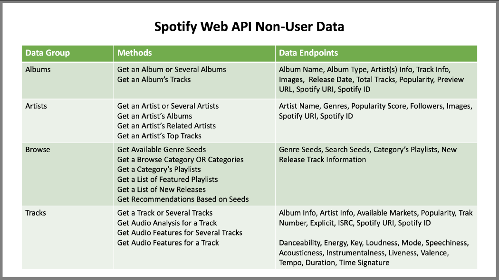

# Music 48 🎵[](https://share.streamlit.io/slevin48/music/main/code/streamlit_app.py)


Started out as a Spotify music recommendation app
***NEW***: Added features from [music-generator](https://github.com/slevin48/music-generator) 🎹

**Content:**
1. [Parse Streaming History](#parse)
2. [Music Taste Analysis](#taste)
3. [Get Recommendation](#reco)
4. [Spotify API](#api)

## 1. <a name="parse"></a>Parse Streaming History

Streaming history can be retrieved from the Spotify profile as JSON, or through the spotipy functions [current_user_recently_played](https://spotipy.readthedocs.io/en/2.16.1/?highlight=current_user_recently_played#spotipy.client.Spotify.current_user_recently_played) or [current_user_saved_tracks](https://spotipy.readthedocs.io/en/2.16.1/?highlight=current_user_saved_tracks#spotipy.client.Spotify.current_user_saved_tracks)


```python
with open("recently_played_20210306.json","r") as f:
    results = json.load(f)

tracks = []
for idx, item in enumerate(results['items']):
    track = item['track']
    tracks.append([idx, track['artists'][0]['name'], track['name']])

trackDict = {"id":[], "artist":[],"name":[]}
for idx, item in enumerate(results['items']):
    track = item['track']
    trackDict["id"].append(idx)
    trackDict["artist"].append(track['artists'][0]['name'])
    trackDict["name"].append(track['name'])
    
import pandas as pd
trackDf = pd.DataFrame.from_dict(trackDict)
```

## 2. <a name="taste"></a>Music Taste Analysis

Analysis of features to produce a polar plot


```python
import spotifyAPI
from secret import clientId,clientSecret
token  = spotifyAPI.get_token(clientId,clientSecret)
lucy_id = spotifyAPI.get_track_id2('Lucy in the Sky', token, artist = 'The Beatles')

url = "https://open.spotify.com/track/"+lucy_id
import webbrowser
webbrowser.open(url)

import pandas as pd

lucy_features = spotifyAPI.get_features(lucy_id,token)
df = pd.DataFrame(lucy_features, index=[0])
df_features = df.loc[: ,['acousticness', 'danceability', 'energy', 'instrumentalness', 'liveness', 'speechiness', 'valence']]

spotifyAPI.feature_plot(df_features)
```


## 3. <a name="reco"></a>Get Recommendation
```python
json_response = spotifyAPI.get_track_reco(lucy_id,token)
uris =[]
for i in json_response['tracks']:
            uris.append(i)
            print(f"\"{i['name']}\" by {i['artists'][0]['name']}")
```


## 4. <a name="api"></a>Spotify API

This notebook leverages the Spotipy module to access the Spotify API:

https://spotipy.readthedocs.io/

* [Basic auth](code/basicMusic.ipynb)
  * Search & Get track
  * Get features
  * Get recommendations
* Spotipy auth
  * Artist albums
  * Artist top tracks
  * Advanced Search ([help](https://spotipy.readthedocs.io/en/2.16.1/#spotipy.client.Spotify.search))
  * Current user
* Access Scopes (detailed later)
  * Saved Tracks
  * Saved Albums ([doc](https://developer.spotify.com/console/get-current-user-saved-albums))
  * Playlist ([doc](https://developer.spotify.com/console/get-current-user-playlists/))
  * Recently played ([doc](https://developer.spotify.com/console/get-recently-played/))
  )
  * Advanced recommendations based on seeds ([doc](https://developer.spotify.com/console/get-recommendations/))



### Scopes

* Images
  * [ugc-image-upload](https://developer.spotify.com/documentation/general/guides/scopes/#ugc-image-upload)
* Spotify Connect
  * [user-read-playback-state](https://developer.spotify.com/documentation/general/guides/scopes/#user-read-playback-state)
  * [user-modify-playback-state](https://developer.spotify.com/documentation/general/guides/scopes/#user-modify-playback-state)
  * [user-read-currently-playing](https://developer.spotify.com/documentation/general/guides/scopes/#user-read-currently-playing)
* Playback
  * [streaming](https://developer.spotify.com/documentation/general/guides/scopes/#streaming)
  * [app-remote-control](https://developer.spotify.com/documentation/general/guides/scopes/#app-remote-control)
* Users
  * [user-read-email](https://developer.spotify.com/documentation/general/guides/scopes/#user-read-email)
  * [user-read-private](https://developer.spotify.com/documentation/general/guides/scopes/#user-read-private)
* Playlists
  * [playlist-read-collaborative](https://developer.spotify.com/documentation/general/guides/scopes/#playlist-read-collaborative)
  * [playlist-modify-public](https://developer.spotify.com/documentation/general/guides/scopes/#playlist-modify-public)
  * [playlist-read-private](https://developer.spotify.com/documentation/general/guides/scopes/#playlist-read-private)
  * [playlist-modify-private](https://developer.spotify.com/documentation/general/guides/scopes/#playlist-modify-private)
* Library
  * [user-library-modify](https://developer.spotify.com/documentation/general/guides/scopes/#user-library-modify)
  * [user-library-read](https://developer.spotify.com/documentation/general/guides/scopes/#user-library-read)
* Listening History
  * [user-top-read](https://developer.spotify.com/documentation/general/guides/scopes/#user-top-read)
  * [user-read-playback-position](https://developer.spotify.com/documentation/general/guides/scopes/#user-read-playback-position)
  * [user-read-recently-played](https://developer.spotify.com/documentation/general/guides/scopes/#user-read-recently-played)
* Follow
  * [user-follow-read](https://developer.spotify.com/documentation/general/guides/scopes/#user-follow-read)
  * [user-follow-modify](https://developer.spotify.com/documentation/general/guides/scopes/#user-follow-modify)


## Resources
* https://dev.to/mxdws/using-python-with-the-spotify-api-1d02
* https://medium.com/python-in-plain-english/music-recommendation-system-for-djs-d253d472677e
* https://github.com/tgel0/spotify-data
* https://towardsdatascience.com/a-visual-look-at-my-taste-in-music-a8c197a728be
* https://medium.com/@maxtingle/getting-started-with-spotifys-api-spotipy-197c3dc6353b
* https://towardsdatascience.com/a-music-taste-analysis-using-spotify-api-and-python-e52d186db5fc
* https://github.com/jmcabreira/A-Music-Taste-Analysis-Using-Spotify-API-and-Python.
* https://medium.com/analytics-vidhya/build-your-own-playlist-generator-with-spotifys-api-in-python-ceb883938ce4
* https://towardsdatascience.com/get-your-spotify-streaming-history-with-python-d5a208bbcbd3
* https://towardsdatascience.com/how-to-utilize-spotifys-api-and-create-a-user-interface-in-streamlit-5d8820db95d5
* https://developer.spotify.com/community/showcase/spotify-audio-analysis/
* https://medium.com/deep-learning-turkey/build-your-own-spotify-playlist-of-best-playlist-recommendations-fc9ebe92826a
* https://www.theverge.com/platform/amp/tldr/2018/2/5/16974194/spotify-recommendation-algorithm-playlist-hack-nelson
* http://sortyourmusic.playlistmachinery.com/
* https://towardsdatascience.com/k-means-clustering-and-pca-to-categorize-music-by-similar-audio-features-df09c93e8b64
* https://towardsdatascience.com/interactive-machine-learning-and-data-visualization-with-streamlit-7108c5032144
* http://druckhaus-hofmann.de/gallery/36-wj-june-2020.pdf
* https://medium.com/swlh/music-genre-classification-using-transfer-learning-pytorch-ea1c23e36eb8
* https://towardsdatascience.com/music-genre-classification-with-tensorflow-3de38f0d4dbb
* https://towardsdatascience.com/machine-learning-and-recommender-systems-using-your-own-spotify-data-4918d80632e3
* https://github.com/anthonyli358/spotify-recommender-systems/blob/main/recommender_playlists.ipynb